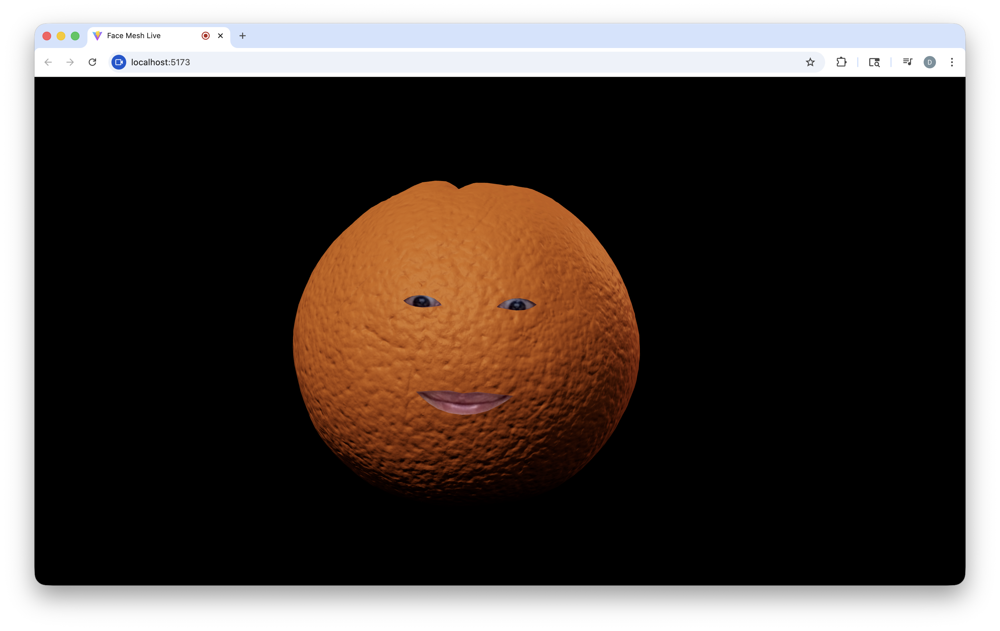

# Citrus Stare

Your webcam, but make it fruit.

This is a tiny browser demo that tracks your face landmarks in real time and puppeteers a 3D orange so it follows your head like an aggressively attentive mascot.

Live demo: https://davidyen1124.github.io/citrus-stare/
Repo: https://github.com/davidyen1124/citrus-stare



## Features

- Webcam face tracking via `@mediapipe/tasks-vision` (`FaceLandmarker`)
- 2D overlay canvas with clipped “feature windows” (eyes + mouth)
- 3D model rendering with `three` + `GLTFLoader`
- Vite dev server

## Run it locally

### Requirements

- Node.js (18+ recommended)

### Install

```bash
npm install
```

### Run

```bash
npm run dev
```

Then open the URL Vite prints (typically `http://localhost:5173`) and allow camera access when prompted.

### Build / Preview

```bash
npm run build
npm run preview
```

## Notes

- This project loads the MediaPipe WASM bundle from `cdn.jsdelivr.net` and the face landmarker model from `storage.googleapis.com` (see `src/main.js`). You’ll need an internet connection for those assets.
- `getUserMedia` requires a secure context: `http://localhost` works locally, but if you try to access the dev server from another device on your LAN you’ll generally need HTTPS.
- Your camera frames are processed locally in the browser; this project doesn’t upload video anywhere (it just downloads the model/WASM).
